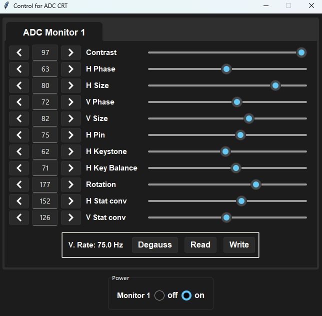

# GUI-for-apple-studio-17-ADC
Use your clear apple studio display on modern Windows!

<div align="center">
  


</div>

## Credits
rdbende's [Sun-Valley](https://github.com/rdbende/Sun-Valley-ttk-theme) tkinter theme

newAM's [monitorcontrol](https://github.com/newAM/monitorcontrol) API

beta testers

## Hardware requirements

intended for apple M7768 commonly known as the Studio Display ADC or Studio Display 17" ADC 

you must use the USB connection to the monitor

you must use a native VGA connection (RAMDAC) or a VGA connection bridged by a displayport DAC

HDMI DACs are not supported

## Building from source
install [Python](https://www.python.org/downloads/windows/) with `pip` for windows 

clone repository, change to the GUI-for-apple-studio-17-ADC directory and run

```
pip install --upgrade .
```

## Running

run `adccrtgui`

## Usage
use mouse and keyboard to adjust controls usually available in the OSD menu of your PC CRT monitor

save and load profiles of settings

degauss the monitor

## Notes
the read button should be used after changing the resolution or settings on the monitor itself

the monitor will forget the changes made through software if you for change change resolution or power cycle
<br/>
please use the write button to confirm your changes and save to the monitor NVRAM
